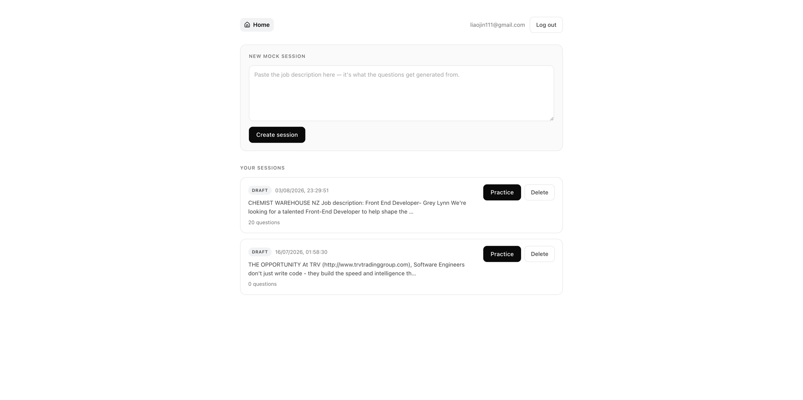
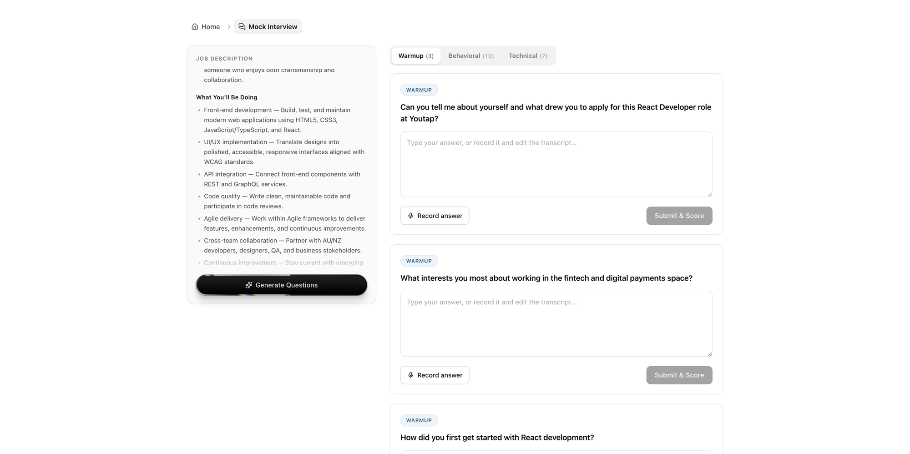

# Interview Coach

A mock interview platform for **non-native English-speaking engineers** job-hunting overseas (starting with New Zealand 🇳🇿).

Paste a job description, get a tiered set of interview questions, and **answer them out loud or by typing**. Spoken answers are transcribed by **Groq-hosted Whisper**, and the transcript is scored by the **Claude API** on content, language and delivery — with the transcript shown back to you so you can correct it before submitting.

Most AI mock-interview tools score *what* you said. Interview Coach also cares about *how* you said it — because for ESL candidates, "I fixed bug in production" and "I fixed **a** bug in production" are the difference between sounding junior and sounding fluent.

## What makes it different

- 🎙️ **Answer by voice, not just by typing** — typing hides the problems that actually cost you the interview: hesitation, filler words, and having to organise a sentence in real time. While recording you see only a waveform and a timer, never live subtitles, so you can't quietly self-correct mid-sentence.
- 🗣️ **ESL-tailored language feedback** — names the exact error pattern (e.g. *"missing article before a countable noun — a common Chinese-L1 transfer"*) and shows your original sentence next to a native-sounding rewrite
- 📈 **Cross-session weakness tracking** — accumulates your error patterns over time (*"you dropped articles in 12 of your last 20 answers"*) and suggests targeted drills
- 🎯 **Three-axis scoring** — every answer is scored separately on **Content** (STAR structure, specifics, quantified results), **Language** (grammar, word order, vocabulary), and **Delivery** (filler words, pace, pauses) — never one vague total
- ✍️ **Two optimized versions of your answer** — a *polished* version that keeps your own experiences (something you can actually say out loud), and a *structural exemplar* that annotates the gaps instead of handing you a script to memorize

## Screenshots

**Sessions** — paste a job description, and each saved session tracks its own question set.



**Mock interview** — the job description stays pinned on the left while you work through the questions on the right, split by tier. Answer by typing, or record and edit the transcript.



## Feature roadmap

| # | Feature | Status |
|---|---------|--------|
| 1 | Monorepo scaffold — Express ↔ React loop with CORS | ✅ |
| 2 | PostgreSQL (Supabase) + Prisma, session/question CRUD | ✅ |
| 3 | JWT auth (register/login, bcrypt, `requireAuth`) | ✅ |
| 4 | AI core: question generation → voice answer → transcription → three-axis scoring | ✅ |
| 5 | Eval harness — labelled test set, scoring rubric, regression run before any prompt change | ⬜ |
| 6 | Retrieval over a company/role knowledge base (Supabase `pgvector`) to ground question generation | ⬜ |
| 7 | Cost telemetry — per-call token accounting, tiered model selection, prompt caching | ⬜ |
| 8 | Resume (PDF) + job description match analysis | ⬜ |
| 9 | Cross-session weakness profile + drills | ⬜ |

## How a session works

1. Paste a job description when you create a session
2. **Generate questions** — Claude produces a tiered set (warmup / behavioural / technical) from the JD
3. **Answer by typing or by voice** — recording shows only a waveform and a timer, never live subtitles, so you can't quietly correct yourself mid-sentence
4. The recording is uploaded, transcribed by **Groq-hosted Whisper**, and the transcript is shown back to you — so a low score and a misheard word stay distinguishable
5. **Claude scores the transcript** on all three axes and returns the language error table plus both rewrite versions

Both answer paths converge on the same scoring and persistence code; transcription simply slots in one step earlier.

## Engineering notes

An LLM feature is mostly ordinary systems work with a probabilistic component bolted into the middle. The parts that took the thinking:

**Spending someone else's money is a failure mode.** Every model call costs real money and free-tier quota, so the code treats it like any other scarce resource:

- **Two independent mock flags.** `MOCK_AI` (Claude) and `MOCK_TRANSCRIPTION` (Groq) are separate, so the voice path can be exercised against the live API while scoring stays free. Collapsing them into one switch means you end up commenting out a line to get the combination you want — and forget to put it back.
- **Short-circuit before the expensive call.** An empty transcript returns 400 *before* `scoreAnswer` runs. A silent recording would otherwise cost a full scoring request.
- **The ownership check guards quota, not just data.** `POST /:id/transcribe` writes nothing, but it spends Groq seconds, so it still verifies the question belongs to the caller through the session relation. Without it, any signed-in user could burn quota against someone else's question id.

**Failures are categorised, not collapsed.** `502` when the upstream provider fails, `500` when it's our bug, `413` for an oversized upload, `400` for an empty recording. The `try` wraps only the provider call — wrapping the whole handler would flatten a DB timeout, a Groq outage and malformed model output into one unhelpful message. Raw provider errors go to the log; the user gets something actionable.

**Model output is parsed, never trusted.** Scoring requests structured output against a Zod schema, so the response is validated at the boundary instead of being regex'd out of a markdown fence. A response that doesn't parse is an error, not a partially-populated score card.

**Repeated calls are safe.** Question generation uses `createMany` + `skipDuplicates` behind a `@@unique(sessionId, text)` constraint — the database enforces idempotency, so a double-clicked button can't produce a duplicate set.

**The interface is designed around the model being wrong.** The transcript is shown back to the user and is editable before scoring, so a bad score and a misheard word stay distinguishable — which matters much more for accented speech. And there are deliberately no live subtitles while recording: watching a transcript form makes you edit yourself mid-sentence, which is exactly the skill the practice is meant to exercise.

Audio is held in memory and never written to disk; uploads are capped at 25 MB.

## Tech stack

| Layer | Choice |
|-------|--------|
| Frontend | React + Vite + TypeScript (deploys to **AWS** — S3 + CloudFront) |
| Backend | Express 5 + TypeScript (deploys to **AWS** — App Runner) |
| Database | PostgreSQL on Supabase + Prisma ORM |
| Auth | JWT + bcrypt |
| AI | Claude API (questions, strict-JSON three-axis scoring) · Groq-hosted Whisper `whisper-large-v3-turbo` (speech-to-text) |
| Uploads | multer (in-memory, 25 MB cap) — audio never touches disk |
| Repo | One repository, two independently installed apps (`client/`, `server/`) sharing `shared/types.ts` via TypeScript path aliases — no workspace tooling. Decoupled frontend/backend: the client is an SPA that only ever talks JSON to its own API. TypeScript strict mode throughout. |

> **Voice answering is Chrome-only for now.** No mimeType negotiation — a deliberate MVP trade-off, not an oversight.

## Project structure

```
interview-coach/
├── shared/types.ts             # API request/response types shared by both sides
├── server/
│   ├── prisma/                 # schema + migrations
│   └── src/
│       ├── index.ts            # Express app (CORS, routes, error handler incl. MulterError)
│       ├── env.ts              # loads + validates .env once, at startup
│       ├── routes/             # auth.ts, sessions.ts, questions.ts
│       ├── services/           # questionService, transcriptionService, scoringService, answerService
│       ├── middleware/         # requireAuth (JWT)
│       ├── lib/                # prisma.ts, anthropic.ts, groq.ts (shared clients)
│       └── utils/logger.ts     # the only place allowed to touch the console
└── client/
    └── src/
        ├── api/                # client.ts (fetch wrapper: base URL, JWT, FormData-aware), interview.ts
        ├── context/            # AuthContext
        ├── hook/               # useAudioRecorder (MediaRecorder + timer + Blob)
        └── pages/              # AuthForm, Sessions, Interview, QuestionCard, Recorder
```

## Getting started

**Prerequisites:** Node.js ≥ 22, a free [Supabase](https://supabase.com) project, an [Anthropic](https://console.anthropic.com) API key, a free [Groq](https://console.groq.com) API key.

```bash
git clone https://github.com/GraceLiao77/interview-coach.git
cd interview-coach

# 1. Server
cd server
npm install
cp .env.example .env        # fill in the values below
npx prisma migrate dev      # create tables
npm run dev                 # http://localhost:3009

# 2. Client (new terminal)
cd client
npm install
npm run dev                 # http://localhost:5173
```

`server/.env` values:

| Variable | What it is |
|---|---|
| `DATABASE_URL` | Supabase **pooled** connection string (port 6543, `?pgbouncer=true`) |
| `DIRECT_URL` | Supabase **direct** connection string (port 5432, used by migrations) |
| `JWT_SECRET` | generate with `openssl rand -base64 32` |
| `ANTHROPIC_API_KEY` | Claude — question generation and scoring |
| `GROQ_API_KEY` | Groq — Whisper transcription |
| `MOCK_AI` | `true` = canned Claude responses, no API cost |
| `MOCK_TRANSCRIPTION` | `true` = canned transcript, no Groq call |

The two mock flags are **separate on purpose**: you can exercise the voice path against the live Whisper API while scoring stays mocked and free.

> If the database suddenly returns `FATAL: (ENOTFOUND) tenant/user postgres.<ref> not found`, your free Supabase project has been auto-paused after ~7 days idle. Restore it from the dashboard and re-copy the connection strings — the pooler hostname can change.

## Verify it works

```bash
curl http://localhost:3009/api/health
# → {"status":"ok","timestamp":"..."}
```

Then open http://localhost:5173, register an account, create a session with a job description, generate questions, and answer one — by typing or by hitting 🎙 and speaking.

---

*Built by a Chinese-native developer job-hunting in Auckland — this app's first user is its author.*
