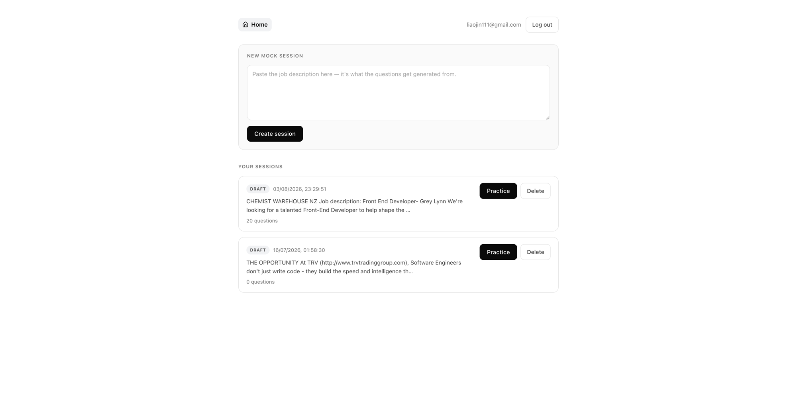
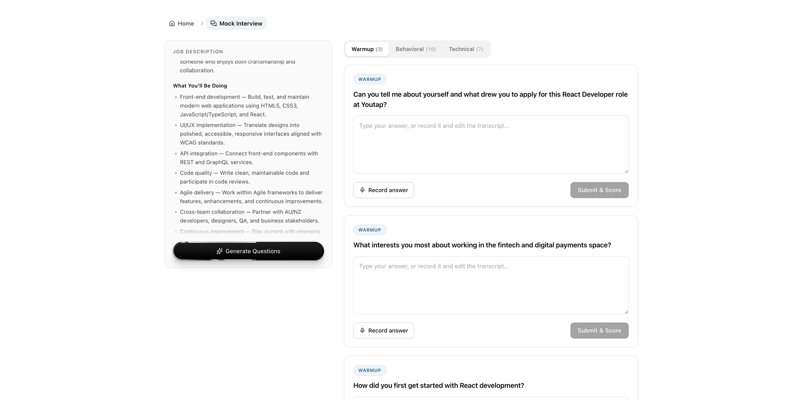

# Interview Coach

A mock interview platform for **non-native English-speaking engineers** job-hunting overseas (starting with New Zealand 🇳🇿).

Paste a job description, get a tiered set of interview questions, and **answer them out loud or by typing**. Spoken answers are transcribed by **Groq-hosted Whisper**, and the transcript is scored by the **Claude API** on content and language — with the transcript shown back to you so you can correct it before submitting.

Most AI mock-interview tools score *what* you said. Interview Coach also cares about *how* you said it — because for ESL candidates, "I fixed bug in production" and "I fixed **a** bug in production" are the difference between sounding junior and sounding fluent.

## What makes it different

- 🎙️ **Answer by voice, not just by typing** — typing hides the problems that actually cost you the interview: hesitation, filler words, and having to organise a sentence in real time. While recording you see only a waveform and a timer, never live subtitles, so you can't quietly self-correct mid-sentence.
- 🗣️ **ESL-tailored language feedback** — names the exact error pattern (e.g. *"missing article before a countable noun — a common Chinese-L1 transfer"*) and shows your original sentence next to a native-sounding rewrite
- 📈 **Cross-session weakness tracking** — accumulates your error patterns over time (*"you dropped articles in 12 of your last 20 answers"*) and suggests targeted drills
- 🎯 **Scored on separate axes** — every answer gets its own **Content** score (STAR structure, specifics, quantified results) and **Language** score (grammar, word order, vocabulary), never one vague total. Each language error is classified against a curated list of error patterns and marked must-fix, should-fix or nice-to-have. A **Delivery** axis (filler words, pace, pauses) is deferred until it can be measured from the recording itself; guessing it from a transcript would only produce a made-up number
- ✍️ **Two optimized versions of your answer** — a *polished* version that keeps your own experiences (something you can actually say out loud), and a *structural exemplar* that annotates the gaps instead of handing you a script to memorize

## Screenshots

**Sessions** — paste a job description, and each saved session tracks its own question set.



**Mock interview** — the job description stays pinned on the left while you work through the questions on the right, split by tier. Answer by typing, or record and edit the transcript.



## Feature roadmap

| # | Feature | Status |
|---|---------|--------|
| 1 | Monorepo scaffold — Express ↔ React loop with CORS | ✅ |
| 2 | PostgreSQL (Supabase) + Prisma, session/question CRUD | ✅ |
| 3 | JWT auth (register/login, bcrypt, `requireAuth`) | ✅ |
| 4 | AI core: question generation → voice answer → transcription → three-axis scoring | ✅ |
| 5 | Eval harness — labelled test set, scoring rubric, regression run before any prompt change | 🟡 first baseline done (Sonnet 5: 77% recall); prompt improvements next |
| 6 | Retrieval over a company/role knowledge base (Supabase `pgvector`) to ground question generation | ⬜ |
| 7 | Cost telemetry — per-call token accounting, tiered model selection, prompt caching | ⬜ |
| 8 | Resume (PDF) + job description match analysis | ⬜ |
| 9 | Cross-session weakness profile + drills | ⬜ |

## How a session works

1. Paste a job description when you create a session
2. **Generate questions** — Claude produces a tiered set (warmup / behavioural / technical) from the JD
3. **Answer by typing or by voice** — recording shows only a waveform and a timer, never live subtitles, so you can't quietly correct yourself mid-sentence
4. The recording is uploaded, transcribed by **Groq-hosted Whisper**, and the transcript is shown back to you — so a low score and a misheard word stay distinguishable
5. **Claude scores the transcript** on content and language and returns the language error table plus both rewrite versions

Both answer paths converge on the same scoring and persistence code; transcription simply slots in one step earlier.

## Engineering notes

An LLM feature is mostly ordinary systems work with a probabilistic component bolted into the middle. The parts that took the thinking:

**Spending someone else's money is a failure mode.** Every model call costs real money and free-tier quota, so the code treats it like any other scarce resource:

- **Two independent mock flags.** `MOCK_AI` (Claude) and `MOCK_TRANSCRIPTION` (Groq) are separate, so the voice path can be exercised against the live API while scoring stays free. Collapsing them into one switch means you end up commenting out a line to get the combination you want — and forget to put it back.
- **Short-circuit before the expensive call.** An empty transcript returns 400 *before* `scoreAnswer` runs. A silent recording would otherwise cost a full scoring request.
- **The ownership check guards quota, not just data.** `POST /:id/transcribe` writes nothing, but it spends Groq seconds, so it still verifies the question belongs to the caller through the session relation. Without it, any signed-in user could burn quota against someone else's question id.

**Failures are categorised, not collapsed.** `502` when the upstream provider fails, `500` when it's our bug, `413` for an oversized upload, `400` for an empty recording. The `try` wraps only the provider call — wrapping the whole handler would flatten a DB timeout, a Groq outage and malformed model output into one unhelpful message. Raw provider errors go to the log; the user gets something actionable.

**Model output is parsed, never trusted.** Scoring requests structured output against a Zod schema, so the response is validated at the boundary instead of being regex'd out of a markdown fence. A response that doesn't parse is an error, not a partially-populated score card.

**Repeated calls are safe.** Question generation uses `createMany` + `skipDuplicates` behind a `@@unique(sessionId, text)` constraint — the database enforces idempotency, so a double-clicked button can't produce a duplicate set.

**The interface is designed around the model being wrong.** The transcript is shown back to the user and is editable before scoring, so a bad score and a misheard word stay distinguishable — which matters much more for accented speech. And there are deliberately no live subtitles while recording: watching a transcript form makes you edit yourself mid-sentence, which is exactly the skill the practice is meant to exercise.

Audio is held in memory and never written to disk; uploads are capped at 25 MB.

## Eval harness

Changing a prompt is easy. Knowing whether it got better is not. A tweak that catches more missing articles can also start flagging correct English, and you won't notice that by reading a few outputs. So the scoring prompt is tested against a fixed, labelled Test Set before any change ships.

**The Test Set** (`server/eval/cases.json`) holds 11 Eval Cases. Each one pairs a question and an answer with what a correct score report must and must not contain:

- **Seeded errors.** A correct native answer with a known error injected (a dropped article, *although … but*, *gonna*), one case for each group of error patterns. Because the error was put there on purpose, its label is right by construction, not by a non-native labeller's judgement.
- **Near-native answers.** These contain nothing to catch. They include things that look wrong but aren't: NZ spelling (*realised*), idioms (*met in the middle*), and deliberately simple spoken English. The model must leave them alone.
- **Axis independence.** One answer has strong content and weak grammar, and another is fluent but empty. Content and Language have to be scored separately.
- **One real answer.** A real, unedited answer from a Chinese-L1 speaker, with the errors a native listener would trip over labelled.

**Grading is code, not another model.** For each case, the harness checks four things:

| Check | Passes when | Measures |
|---|---|---|
| Content / Language band | the score falls inside the expected range | calibration |
| Must-catch errors | some flagged error contains the labelled span **and** has the labelled pattern code | recall |
| Must-not-flag spans | no must-fix or should-fix error overlaps a correct span (a nice-to-have style suggestion is allowed) | false positives |

Grading is a pure function over the saved model output. When the grading rules change, old runs can be re-graded without paying for the model calls again. Grading is also free and gives the same result every time, which an LLM judge wouldn't.

**The harness had its own bugs, too.** A must-not-flag check used `&&` where it needed `||`, so it only caught exact matches. The mock data couldn't expose that. A short span like *but* produced a false pass by matching an unrelated error, so a match now has to agree on the error pattern as well. And the first one-case canary run failed before sending a request: the API client was created at import time, before the env file had loaded. It cost nothing, and the fix was to pass the key in explicitly so the client doesn't depend on import order.

```bash
cd server
MOCK_AI=true  npm run eval                                                   # free: canned model output, checks the plumbing
MOCK_AI=false npm run eval -- --model claude-sonnet-5 --only grammar-01      # one paid case: a canary before the full run
MOCK_AI=false npm run eval -- --model claude-sonnet-5                        # the full set, about NZ$0.5 on Sonnet 5
MOCK_AI=false npm run eval -- --model claude-sonnet-5 --runs 3               # three runs, to see how much the scores move on their own
```

The run stops with exit code 1 on a malformed case, a span that isn't in its answer, a duplicate id, an unknown `--model`, or an `--only` id that doesn't exist. A mistyped model is refused rather than quietly replaced by the default, because that would mean paying for the wrong run.

Each run saves a baseline named after the model it tested (`eval/baselines/<model>.json`). The file is rewritten after every case, so a run that dies halfway keeps what it already paid for, and `complete: false` says it didn't finish. The file holds the per-run totals, a per-case breakdown, and the raw model output, which can be re-graded for free when the grading rules change. A prompt change and the baseline it produced are committed together, so git history shows each prompt next to its score.

**Model output isn't deterministic,** and current models don't accept a temperature setting. With 22 labelled errors, one more or one fewer catch moves recall by 4.5%. So `--runs` runs the whole set several times and reports each total's range (for example `mustCatch 15-18/22`), plus every check that passed in some runs and failed in others (*flaky*). A prompt change only counts if it moves the numbers past that range. Must-not-flag works as a guardrail: a change that raises recall but flags more correct English isn't accepted.

### First baseline

The scoring prompt was first changed only as much as grading needed: a 1–5 scale, verbatim error spans, and a pattern code from the curated list. Everything else stayed as crude as before, so each later improvement can be measured on its own.

```
claude-sonnet-5, 11 cases
content 11/11 · language 10/11 · mustCatch 17/22 · mustNotFlag 21/22 · errors 0
```

The totals looked good. The raw output showed what they missed:

- **Merged errors.** On the real non-native answer, the model folded several mistakes into one long span under a single code, so only 4 of 9 labelled errors matched.
- **Flagging correct English.** On a correct, deliberately simple answer, the model flagged five things, including a present-tense conditional that was fine. Only one of them was a labelled span, so the score showed one false positive where there were five. **Passing an eval only means passing what you labelled.**
- **Score and reasoning disagree.** On a near-empty answer, the model wrote that it was too short to judge, then gave Language 4/5.

Those three findings are the next prompt changes, in that order. Each one is run against this baseline before it's kept.

## Tech stack

| Layer | Choice |
|-------|--------|
| Frontend | React + Vite + TypeScript (deploys to **AWS** — S3 + CloudFront) |
| Backend | Express 5 + TypeScript (deploys to **AWS** — App Runner) |
| Database | PostgreSQL on Supabase + Prisma ORM |
| Auth | JWT + bcrypt |
| AI | Claude API (questions, strict-JSON scoring) · Groq-hosted Whisper `whisper-large-v3-turbo` (speech-to-text) |
| Uploads | multer (in-memory, 25 MB cap) — audio never touches disk |
| Repo | One repository, two independently installed apps (`client/`, `server/`) sharing `shared/types.ts` via TypeScript path aliases — no workspace tooling. Decoupled frontend/backend: the client is an SPA that only ever talks JSON to its own API. TypeScript strict mode throughout. |

> **Voice answering is Chrome-only for now.** No mimeType negotiation — a deliberate MVP trade-off, not an oversight.

## Project structure

```
interview-coach/
├── shared/types.ts             # API request/response types shared by both sides
├── server/
│   ├── prisma/                 # schema + migrations
│   ├── eval/                   # eval harness: cases.json (Test Set), runEval.ts, grade.ts, baselines/
│   └── src/
│       ├── index.ts            # Express app (CORS, routes, error handler incl. MulterError)
│       ├── env.ts              # loads + validates .env once, at startup
│       ├── routes/             # auth.ts, sessions.ts, questions.ts
│       ├── services/           # questionService, transcriptionService, scoringService, answerService
│       ├── middleware/         # requireAuth (JWT)
│       ├── lib/                # prisma.ts, anthropic.ts, groq.ts (shared clients)
│       └── utils/logger.ts     # the only place allowed to touch the console
└── client/
    └── src/
        ├── api/                # client.ts (fetch wrapper: base URL, JWT, FormData-aware), interview.ts
        ├── context/            # AuthContext
        ├── hook/               # useAudioRecorder (MediaRecorder + timer + Blob)
        └── pages/              # AuthForm, Sessions, Interview, QuestionCard, Recorder
```

## Getting started

**Prerequisites:** Node.js ≥ 22, a free [Supabase](https://supabase.com) project, an [Anthropic](https://console.anthropic.com) API key, a free [Groq](https://console.groq.com) API key.

```bash
git clone https://github.com/GraceLiao77/interview-coach.git
cd interview-coach

# 1. Server
cd server
npm install
cp .env.example .env        # fill in the values below
npx prisma migrate dev      # create tables
npm run dev                 # http://localhost:3009

# 2. Client (new terminal)
cd client
npm install
npm run dev                 # http://localhost:5173
```

`server/.env` values:

| Variable | What it is |
|---|---|
| `DATABASE_URL` | Supabase **pooled** connection string (port 6543, `?pgbouncer=true`) |
| `DIRECT_URL` | Supabase **direct** connection string (port 5432, used by migrations) |
| `JWT_SECRET` | generate with `openssl rand -base64 32` |
| `ANTHROPIC_API_KEY` | Claude — question generation and scoring |
| `GROQ_API_KEY` | Groq — Whisper transcription |
| `MOCK_AI` | `true` = canned Claude responses, no API cost |
| `MOCK_TRANSCRIPTION` | `true` = canned transcript, no Groq call |

The two mock flags are **separate on purpose**: you can exercise the voice path against the live Whisper API while scoring stays mocked and free.

> If the database suddenly returns `FATAL: (ENOTFOUND) tenant/user postgres.<ref> not found`, your free Supabase project has been auto-paused after ~7 days idle. Restore it from the dashboard and re-copy the connection strings — the pooler hostname can change.

## Verify it works

```bash
curl http://localhost:3009/api/health
# → {"status":"ok","timestamp":"..."}
```

Then open http://localhost:5173, register an account, create a session with a job description, generate questions, and answer one — by typing or by hitting 🎙 and speaking.

---

*Built by a Chinese-native developer job-hunting in Auckland — this app's first user is its author.*
