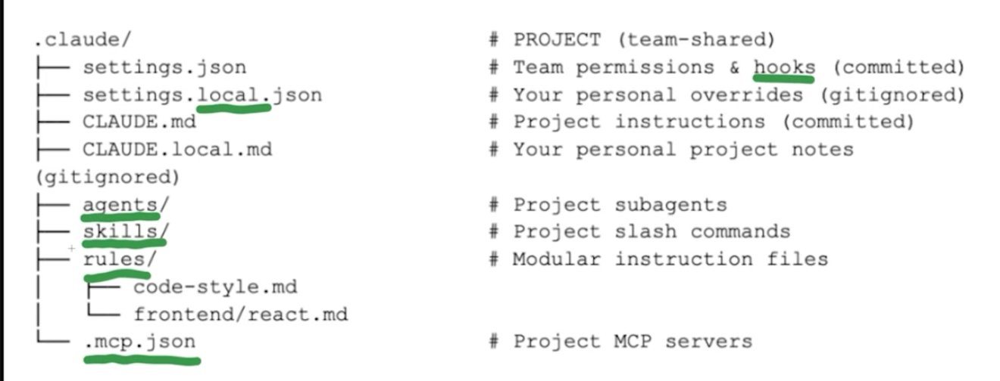

# Claude Code 项目文件结构说明

> `.claude/` 是 Claude Code 在项目根目录下的配置文件夹，决定了 Claude 在这个项目里"以什么样的方式工作"。类似于 `.vscode/` 存 VSCode 的项目配置、`.github/` 存 GitHub Actions 配置。



---

## 核心概念

`.claude/` 是 Claude 的"项目专属大脑"——里面存着**这个团队/这个项目**希望 Claude 遵守的规则、可以用的工具、自动化流程。

## 一个关键设计:Team-shared vs Personal(团队共享 vs 个人)

看那两组文件名的成对关系:

| Team-shared(提交进 Git) | Personal(gitignored) |
|---|---|
| `settings.json` | `settings.local.json` |
| `CLAUDE.md` | `CLAUDE.local.md` |

**这是这个结构最聪明的地方**:团队所有人共享一套基础配置,同时每个开发者可以有自己的私人覆盖,不会污染仓库。

举例说明:

- 团队规定 "Claude 提交代码前必须跑 lint"(写在 `settings.json` 里,全组共享)
- 但你个人希望 Claude "帮我把中文注释翻译成英文再提交"(写在 `settings.local.json` 里,只影响你)

`.local.json` / `.local.md` 的文件因为在 `.gitignore` 里,**不会被 push 到远端**,所以你的个人偏好不会影响同事。

---

## 逐个拆解

### 📄 `settings.json` — Team permissions & hooks(团队共享)

这个文件定义两件事:

- **Permissions(权限)**:Claude 在这个项目里被允许 / 禁止做什么。比如:允许它跑 `npm test`,禁止它跑 `rm -rf`、禁止它访问某些敏感目录。这是团队的**安全策略**。
- **Hooks(钩子)**:类似 Git hooks,Claude 在某个操作前后自动触发的动作。比如:每次 Claude 修改代码后自动跑 `prettier` 格式化;提交前自动跑测试。

**"committed" 的意思**:这个文件会被提交到 Git 仓库,所有克隆项目的开发者都会拿到同一份。

### 📄 `settings.local.json` — 你的个人 overrides(gitignored)

覆盖 `settings.json` 里的部分设置,只对你生效。比如全组的 `settings.json` 里没有开启某个实验性功能,你可以在 `settings.local.json` 里为自己单独开启。

### 📄 `CLAUDE.md` — Project instructions(团队共享)

**这个文件是最重要的一个**——它是给 Claude 读的"项目说明书"。Claude 每次在这个项目里工作时,会先读这个文件了解项目背景。

典型内容包括:

- 项目是干什么的
- 用了什么技术栈
- 代码组织约定(比如"所有 API 请求都要放在 `src/api/` 下")
- 命名规范
- 团队的其他约定俗成

举例(mock interview 项目):

```markdown
This is a mock interview tool for ESL software engineers.

Frontend: React + Vite + TypeScript, deployed on Vercel
Backend: Express + TypeScript, deployed on Fly.io
DB: PostgreSQL via Supabase (using Prisma ORM)

Conventions:
- Never use console.log in production code; use the logger in src/utils/logger.ts
- All API routes live in src/api/
- Database migrations must be reviewed before merging
```

写完提交,之后你或任何人打开这个项目跟 Claude 对话,它都自动带着这些上下文。

### 📄 `CLAUDE.local.md` — 你个人的项目笔记(gitignored)

你自己给 Claude 的额外指示,只对你生效。比如:

- "我是 ESL 学生,请用简单英语解释错误信息"
- "帮我在每次提交前 double check 我的英语拼写"

这些不适合放到团队版里(同事不需要),但对你个人很有用。

### 📁 `agents/` — Project subagents(子代理)

**Subagent 是 Claude 的一个高级功能**——你可以定义一个"专门做某类任务的 AI 助手",比如:

- 一个专门写测试的 subagent
- 一个专门做代码 review 的 subagent
- 一个专门写数据库迁移的 subagent

放在这个目录下的 subagent 定义会跟着项目走,团队共享。

### 📁 `skills/` — Project slash commands(斜杠命令)

存放**skills**——一些你能在 Claude 里直接调用的可复用功能。

比如你可以定义一个 `/deploy` 命令,让 Claude 执行"跑测试 → 构建 → 部署到 Fly.io"这一整套流程。或者 `/new-page` 命令,让 Claude 生成一个新的 React 页面框架。

这些命令对整个团队可用。

### 📁 `rules/` — Modular instruction files(模块化规则)

把 `CLAUDE.md` 里的规则**拆分成多个小文件**,按主题组织:

- `rules/code-style.md` — 代码风格规范
- `rules/frontend/react.md` — 只在写 React 代码时启用的规则

好处:当项目变大,规则很多的时候,一个 `CLAUDE.md` 会变得难以维护。拆分后 Claude 可以按上下文加载对应的规则文件——你在改 React 代码时只加载 `react.md`,不用把整个规则集塞进 context。

### 📄 `.mcp.json` — Project MCP servers(MCP 服务器)

**MCP = Model Context Protocol**(模型上下文协议),Anthropic 定义的一个标准,让 Claude 能连接外部工具和数据源。

这个文件配置了**这个项目需要用到哪些 MCP 服务器**。比如:

- 连接 GitHub API(自动创建 PR、读 issues)
- 连接你的 Supabase 数据库(Claude 直接可以查数据库结构)
- 连接 Fly.io(Claude 直接可以看部署状态)

配置好后,团队所有人的 Claude 都能用这些工具,一致性高。

---

## 类比熟悉的东西

| Claude 项目文件 | 类似的东西 |
|---|---|
| `.claude/` | `.vscode/` 或 `.eslintrc/` |
| `CLAUDE.md` | `README.md` 但写给 AI 看的 |
| `settings.json` | `tsconfig.json` 或 `.prettierrc` |
| `settings.local.json` | 你个人的 VSCode `settings.json` |
| `agents/` | 一堆你自己写的小工具脚本 |
| `.mcp.json` | 类似 `package.json` 声明依赖,但依赖的是"外部服务" |

---

## `.gitignore` 建议

如果你的项目开始使用 `.claude/` 结构,记得在 `.gitignore` 里加上:

```gitignore
# Claude Code personal overrides
.claude/settings.local.json
.claude/CLAUDE.local.md
```

这样你的个人配置不会被误提交到远端仓库。

---

## 对 Mock Interview 项目的实际意义

如果用 Claude Code 开发,可以立刻做这几件事让效率翻倍:

1. **写一个 `CLAUDE.md`**:把项目背景、技术栈、目录结构说清楚——之后每次让 Claude 帮你写代码都不用再重复解释项目背景。
2. **配 `.mcp.json` 接上 Supabase**:Claude 可以直接读你的数据库 schema,写数据库相关代码不会瞎猜字段名。
3. **写一个 `rules/frontend/react.md`**:写清楚你项目里 React 的约定(组件结构、状态管理用什么),Claude 生成的代码风格就会稳定。
4. **在 `CLAUDE.local.md` 里写你的英语学习偏好**:让 Claude 在代码 review 时顺便帮你检查 commit message 的英语。

---

## 参考

- Claude Code 官方文档: https://docs.claude.com/claude-code
- Model Context Protocol: https://modelcontextprotocol.io
